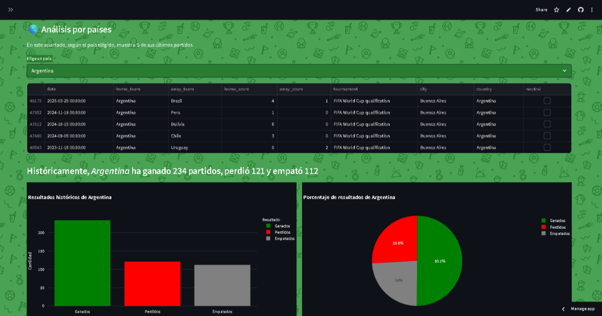
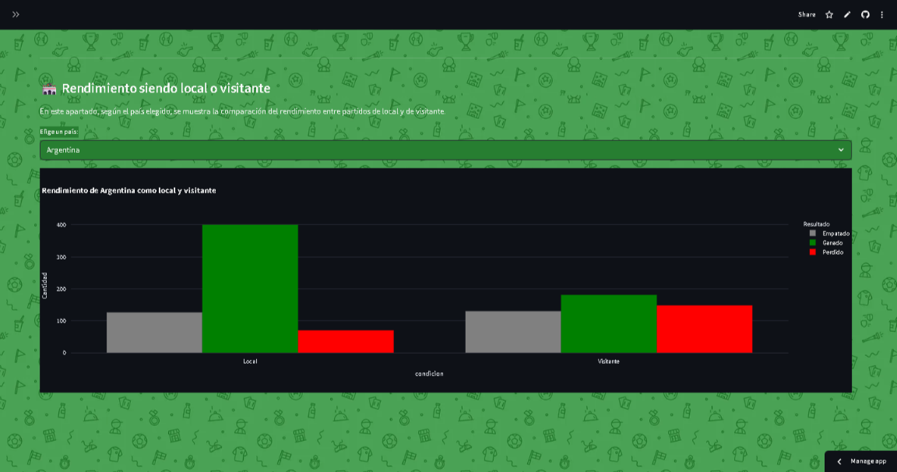

# ⚽ Análisis Histórico de Partidos Internacionales


Aplicación web interactiva creada con **Streamlit** que permite visualizar, filtrar y analizar resultados de selecciones nacionales de fútbol a lo largo de la historia.

---

## 🌟 Funcionalidades principales

- Visualización de partidos por país
- Análisis de resultados: ganados, empatados y perdidos
- Mapas y gráficos de torta, barras e histogramas por país
- Comparación de rendimiento como **local vs visitante**
- Filtro por tipo de resultado y año

---

## 📷 Capturas de pantalla

### Página principal:


### Análisis por Países:


### Comparación Local vs Visitante:


---

## 🔧 Tecnologías utilizadas

- [Streamlit](https://streamlit.io/)
- [Pandas](https://pandas.pydata.org/)
- [Plotly](https://plotly.com/)
- [NumPy](https://numpy.org/)
- [Seaborn](https://seaborn.pydata.org/)

---

## 🚀 Cómo correr el proyecto localmente

1. Cloná el repositorio:

   ```bash
   git clone https://github.com/alejotrenti/football-national-analysis.git
   cd football-national-analysis
   ```

2. Instalá las dependencias:

   ```bash
   pip install -r requirements.txt
   ```

3. Ejecutá la app:

   ```bash
   streamlit run app.py
   ```

---

## 🌐 App desplegada

📲 Podés probar la app en vivo desde este enlace:

👉 [https://football-national-analysis-bzygbrevqxzsavtjuappanw.streamlit.app/](https://football-national-analysis-bzygbrevqxzsavtjuappanw.streamlit.app/)

---

## 🧠 Sobre el proyecto

Este proyecto fue creado como parte de mi aprendizaje de **Streamlit** y visualización de datos. El dataset incluye todos los partidos internacionales desde 1872. Sirve como base para análisis de rendimiento, tendencias históricas y comparaciones entre selecciones.

---


